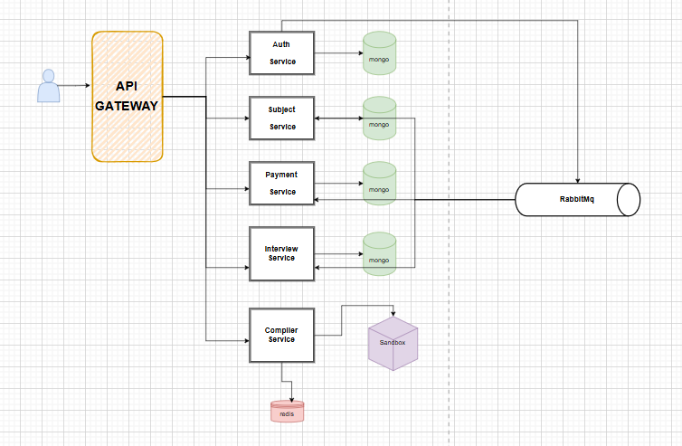

# LevelUp Coders

**LevelUp Coders** is an innovative platform designed to make learning JavaScript fun and engaging by combining the thrill of gaming with education. The platform provides a game-like experience with interactive levels that teach JavaScript concepts in an immersive and progressive manner. 

## Features

- **Interactive Challenges:** Solve coding problems that simulate real-world scenarios.  
- **Live Compiler:** Run JavaScript and Python code directly within the platform using a secure sandbox environment.  
- **Engaging Layout:** A visually appealing design tailored for an enjoyable learning experience.  
- **Progress Tracking:** Track your coding journey and celebrate milestones.  

## Getting Started

LevelUp Coders is perfect for:
- Beginners starting their programming journey.  
- Developers looking to strengthen their JavaScript fundamentals.  

Stay motivated, level up your coding skills, and enjoy the process!

## Service

## License

This project is licensed under the [GPL License](LICENSE).

---
